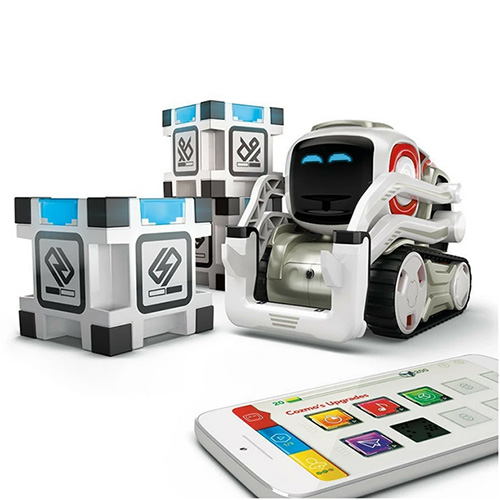

# Cozmo 

  

In this folder, you can find all the resources you need to get started with **Cozmo**:

- 📘 **[User Guide](Cozmo_Guide.pdf)** – Detailed instructions on how to set up and use Cozmo.  
- 💻 **[Sample Code](sample_code/)** – Example programs to help you start developing your own projects.

---

⚠️ **Important Notice:**  
All equipment underwent thorough testing and verification prior to its availability to students. Kindly exercise caution and ensure the return of each item enclosed in the box in the **same condition** as it was borrowed.

---

Use these materials to understand how Cozmo works and to accelerate your project development.
