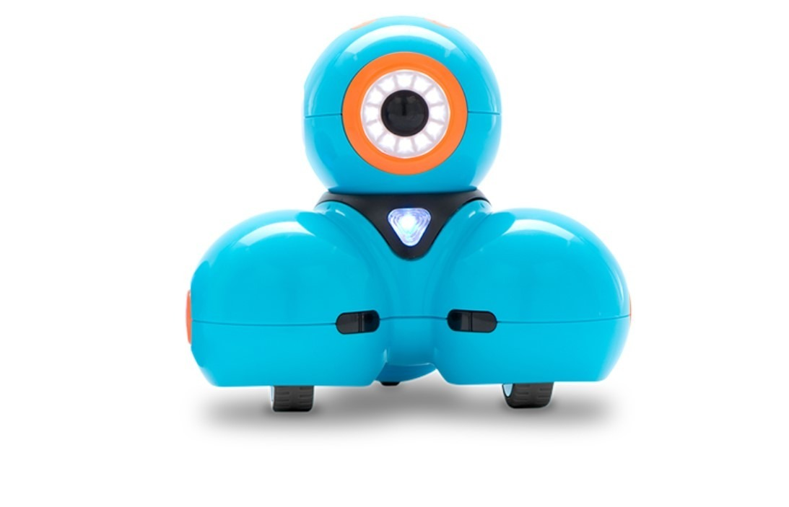

# Dash 




## What is Dash?
Dash is a small, programmable robot designed for educational purposes, particularly for teaching children coding and robotics concepts. However, it can also be programmed using python for more advanced users.

### Dash hardware

Dash components are:
- LED's
- Buttons
- IR Receivers and Transmitters
- Motors for head pan and tilt
- Sensors (proximity, accelerometer, gyroscope)
- Bluetooth
- 3 Microphones
- 3 Speakers  
- 3 wheels 

> [!CAUTION]
> All equipment underwent thorough testing and verification prior to its availability to students. Kindly exercise caution and ensure the return of each item enclosed in the box in the **same condition** as it was borrowed.

## What you need to use Dash?

- 1 Dash
- 1 Bluetooth USB Adapter (Optional)
- 1 Charging cable  

## How to quickly start with Dash?

### First you must configure the set-up

> [!IMPORTANT]
> To program Dash you need to use a linux environment(macOS and windows are not supported). So if you are not using a linux distribution as your OS, use a Virtual Machine or Dual Boot.

2. Assure that you are using a python 2.7 or create your  virtual environment with that python version.

3. Create a virtual environment.
> [!WARNING]
> It is good practice to create a virtual environment for each of your projects! 

4. Install BlueZ (version 5+ is required by pygatt)
```
sudo apt-get install bluez 
```

5. Clone [MorseAPI github repository](https://github.com/IlyaSukhanov/morseapi) 
```
git clone https://github.com/IlyaSukhanov/morseapi.git
```

6. Install Morse API 
```
cd morseapi
pip install -e .
```

### Control Dash

1. Find the bluetooth address of the robot
    - Turn on the robot
    - Use your smartphone or connect the bluetooth adapter provided and see if you can connect to Dash
    - See the bluetooth address and copy it
    - ***Disconnect Dash from your smartphone or computer***, this is important, the code fails to connect via bluetooth if the robot is already connected to anything

2. Run the [sample code](dash_test.py):
```
python dash_test.py <dash_bluetooth_address>
```

>[!Note]
> If If you get any errors try to run the python script with root.


